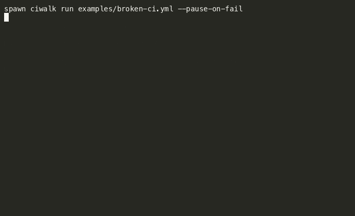

# ciwalk


Run your CI pipeline locally, **pause at any step**, drop into a live shell to inspect or fix state, then **retry / continue** — no more commit-push-pray.



```bash
pip install -e .
ciwalk run examples/broken-ci.yml --pause-on-fail
```

## Why

CI feedback is still mostly blind: edit YAML → commit → push → wait → read logs → guess. Tools like [`act`](https://github.com/nektos/act) run Actions locally but are still all-or-nothing. `ciwalk` keeps the container alive, opens a shell at the failure point, and lets you resume.

## Requirements

- Python 3.11+
- Docker (daemon running)

## Install

```bash
git clone https://github.com/kiwi-07/ciwalk.git && cd ciwalk
pip install -e ".[dev]"
```

## Usage

```bash
ciwalk run <workflow.yml> [OPTIONS]
```

| Flag | Meaning |
|---|---|
| `--job / -j NAME` | Job id (required if the workflow has multiple jobs) |
| `--pause-on-fail` | On failure, open a shell then ask retry / continue / abort |
| `--breakpoint / -b NAME` | Pause *before* a step (exact step name) |
| `--image IMAGE` | Override runner image (default: `catthehacker/ubuntu:act-latest`) |
| `--workdir / -C PATH` | Host path mounted as `/github/workspace` (default: cwd) |
| `--keep` | Leave the container running after the job ends |
| `--input / -i KEY=VALUE` | Set `${{ inputs.* }}` (repeatable; overrides workflow defaults) |

```bash
ciwalk cleanup           # remove leftover ciwalk containers (e.g. after kill -9)
ciwalk cleanup --dry-run # list matching containers without removing them
```

### Pause flow

1. A step fails (with `--pause-on-fail`) or you hit `--breakpoint`.
2. `ciwalk` attaches an interactive shell **inside the same container** (same bash flags, env, and working-directory as the step).
3. Inspect / fix (mounted workspace is live on the host too).
4. `exit` (or Ctrl+D) → choose **`retry`** | **`continue`** | **`abort`**.
5. `continue` after a failure still exits **non-zero** (the failed step stays failed).

## Demo

```bash
ciwalk run examples/broken-ci.yml --pause-on-fail
```

Matches [`examples/broken-ci.yml`](examples/broken-ci.yml): checkout + **Prepare workspace** pass; **Require marker file** fails (`build/MARKER` missing). In the shell:

```bash
touch build/MARKER
exit
```

Then choose **`retry`**. The step passes, **Finish** runs, and the job completes.

Recording source: [`docs/demo.cast`](docs/demo.cast) (replay with `asciinema play docs/demo.cast`).

## Supported GitHub Actions subset (MVP)

- Single job per run (`--job` if needed)
- `runs-on: ubuntu-latest` (or omit)
- Steps: `run`, `name`, `env`, `working-directory`
- `uses: actions/checkout@*` → bind-mount workspace (no network clone)
- `${{ inputs.* }}` / `${{ env.* }}` string substitution (`--input KEY=VALUE`)
- Any other `${{ }}` (or unknown `inputs.*` / `env.*` key) → **error**, not empty-string rewrite
- Jobs that are reusable workflow calls, or use job-level `needs:` / `if:` → **SKIPPED** (loud, non-zero exit — never silent pass)

**Not yet:** matrix/parallel jobs, secrets, full expression language (`github.*`, `secrets.*`, …), arbitrary marketplace actions, GitLab/Circle/Jenkins, caching.

### Roadmap / want to help?

Gaps above are intentional MVP cuts, not forever. Prefer contributions around expression support (`github.*`), matrix builds, and broader `uses:` allowlisting — file an [issue](https://github.com/kiwi-07/ciwalk/issues) or PR on `develop`. Good first issues welcome once labeled.

## Development

```bash
pip install -e ".[dev]"
pytest
```

### Linux smoke (T1–T4)

Native Linux Docker bind-mount behavior can differ from Docker Desktop on Mac. CI runs this on `ubuntu-latest`:

```bash
scripts/linux-smoke.sh
```

## License

MIT
